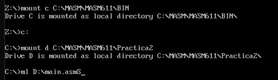

# Manual Técnico

## Requerimientos para la Aplicaión
```
Sistema Operativo requerido: Windows 8 o superiores.
Memoria Ram: 4 GB o Superiores.
Requerimiento de Ejecucion: EMU8086, DOSBOX y MASM
Procesador: Intel Core i3 o superiores.
Tipo de Sistema: 64bit.
```

# Ejecución de la Aplicación

*Para realizar está acción el usuario debera de colocar su proyecto en la carpeta C de donde instalo assembler (En el video explica donde tiene que ir ubicada la carpeta MASM11) se deja un ejemplo donde puede ir la carpeta.*


_Al tener nuestra carpeta aquí podemos entrar a las configuraciones de DosBOX y cambiar la ruta para la compilación del archivo_


*Como podemos observar en la imagen anterior, tenemos que buscar esta opcion para poder ingresar a las opciones de DosBox, al entrar se nos abrira un archivo txt en el cual iremos hasta el final del mismo y enocontraremos el apartado de autoexec en el cual pondremos la siguiente ruta que se muestra en la imagen*


```
mount c C:\MASM\MASM611\BIN
Para agregar la ruta del exe
mount d C:\MASM\MASM611\Nombredelacarpetadelproyecto
```
*Y listo, con eso ya tienen confidurada la ruta para poder compilar y ejecutar, para lo cual veremos a continuacion como se compila y se ejecuta.*




# Sprites de los personajes

*En la siguiente porcion de codigo podremos ver cada uno de los sprites que se usaran dentro del juego, estos se crearon mediante una matriz de 8x8 bits*


*En la siguiente imagen se mostraran las variables*


# Funciones

*En la siguiente imagen se mostraran las funciones que se usaron para poder cargar el juego y que se mostrara en la pantalla principal*


*Objetos usados en las partidas*


*Parseos*


*Por consiguiente, dentro del codigo va explicitamente comentado que realiza cada una de las acciones correspondientes*