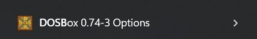
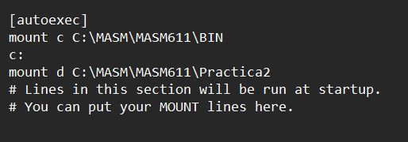
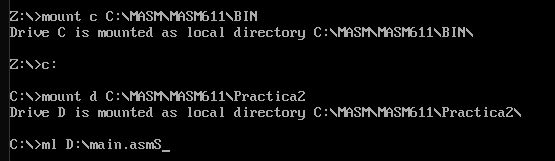
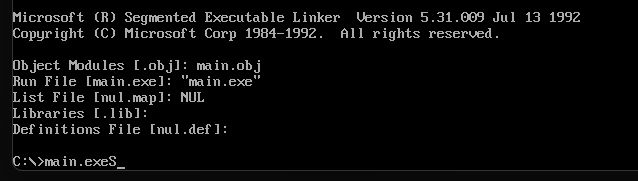
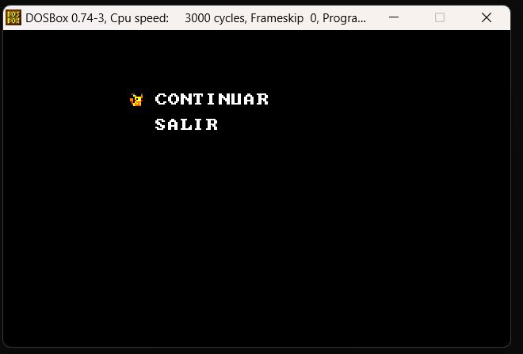
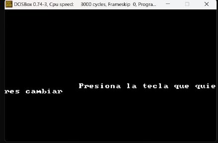

# Manual de Usuario

## Requerimientos para la Aplicaión
```
Sistema Operativo requerido: Windows 8 o superiores.
Memoria Ram: 4 GB o Superiores.
Requerimiento de Ejecucion: EMU8086, DOSBOX y MASM
Procesador: Intel Core i3 o superiores.
Tipo de Sistema: 64bit.
```

## Instalación de EMU8086, DosBosx y MASM
*Para ejecutar la siguiente aplicación el usuario debera tener instalado los siguientes programas y lenguaje para poder tener una mejor experiencia y como tal para poder ver como se ejecuta la imformación, para lo siguiente se deja un video en el cual, él usuairo puede ver paso a paso como hacerlo.*

[Instalación de los programas requeridos](https://www.youtube.com/watch?v=q6Z6p9RD7yw)


# Ejecución de la Aplicación

*Para realizar está acción el usuario debera de colocar su proyecto en la carpeta C de donde instalo assembler (En el video explica donde tiene que ir ubicada la carpeta MASM11) se deja un ejemplo donde puede ir la carpeta.*


_Al tener nuestra carpeta aquí podemos entrar a las configuraciones de DosBOX y cambiar la ruta para la compilación del archivo_



*Como podemos observar en la imagen anterior, tenemos que buscar esta opcion para poder ingresar a las opciones de DosBox, al entrar se nos abrira un archivo txt en el cual iremos hasta el final del mismo y enocontraremos el apartado de autoexec en el cual pondremos la siguiente ruta que se muestra en la imagen*



```
mount c C:\MASM\MASM611\BIN
Para agregar la ruta del exe
mount d C:\MASM\MASM611\Nombredelacarpetadelproyecto
```
*Y listo, con eso ya tienen confidurada la ruta para poder compilar y ejecutar, para lo cual veremos a continuacion como se compila y se ejecuta.*




*Ya con esto, se procede al menu principal*

## Menu Principal
_En el menu principal, el usuario puede mover al pikachu con las flechas de arriba y abajo para poder seleccionar una opcion se debe de presionar F1, tener en cuenta que al inicio de la aplicacion se mostraran los datos del desarrollador:_


*Para iniciar el juego debemos de cargar los mapas, por lo cual debemos de seleccionar la opcion de cargar nivel, por lo cual al darle F1 entraremos al juego, podremos observar en el marco que estan las iniciales del creador y el carnet, en la misma pantalla podremos ver el juego en el cual debemos de mover las pokeballs hacia las R para poder derrotarlos y cada vez que se va moviendo se van generando los puntos en la partida.*


*Al terminar de mover todas las pokeballs pasaremos al siguiente nivel, al completar todos los niveles se terminara el juego, para tener un ejemplo de como se veria el mapa terminado tenemos el siguiente ejemplo*


*Como podemos ver, cada vez que un objetivo encaja con una R en el suelo cambia su coloar esto nos indica que ha derrotado al contrincante*

*Para poder colocar pausa al juego usaremos la tecla F2 en el cual nos mostrara el menu de pausa para poder salir o continuar con el juego*



*Al salir, nos dirigimos al menu principal nuevamente, cuando estemos aqui podremos cambiar las teclas con las cuales podemos mover a nuestro personaje, por ejemplo el estandar es usar las flechas, podemos cambiar a usar las letras wasd para poder movernos*



*Debemos de seleccionar primera la tecla con la que estamos controlando a nuestro jugador y posterior escoger la nueva tecla que tendra el nuevo manejo de nuestro personaje*

*Al ser una primera version del juego tenemos muchas mejoras pensadas para el futuro, esto se ira mejorando mediante pasa el tiempo y los comentarios que nos den nuestros jugadores para poder implementar nuevas funcionalidades, hacerlo mas interactivo y entretenido, por lo cual estaremos anunciando nuestra segudan poke talk para traerles los avances y sneak peek de la jugabilidad de este, nos veremos pronto...!*